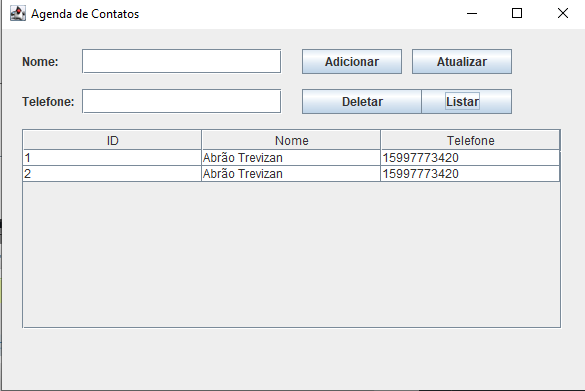
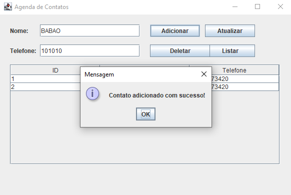
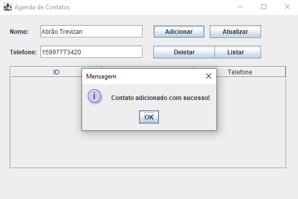
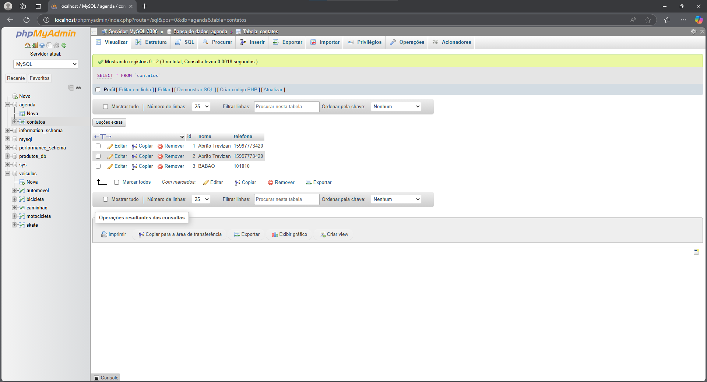

# Lista de Exercícios - AGENDA PESSOAL

## 🚀 Começando

* CRIE O PROJETO AGENDA PESSOAL;
* REPRODUZA OS PASSOS MENCIONADOS NO CONTEÚDO DA AULA 13, INCLUSIVE OS COMENTÁRIOS DOS CÓDIGOS;
* COMPILE O PROJETO E SE CERTIFIQUE QUE O MESMO ESTÁ EM FUNCIONAMENTO;
* GERE O JAVADOC DO PROJETO;
* POR FIM, ARMAZENE O PROJETO EM UM REPOSITÓRIO REMOTO;
* MONTE SEU README.MD DO PROJETO E OS PASSOS PARA REPRODUÇÃO;
* ENVIE O LINK DO SEU REPOSITÓRIO NA ATIVIDADE.

## 🛠️ Construído com

* EclipseIDE

## 📌 Versão

* **Versão 1.0** 

## ✒️ Autores

* **Abrão Alves Trevizan** - *AGENDA PESSOAL* 
